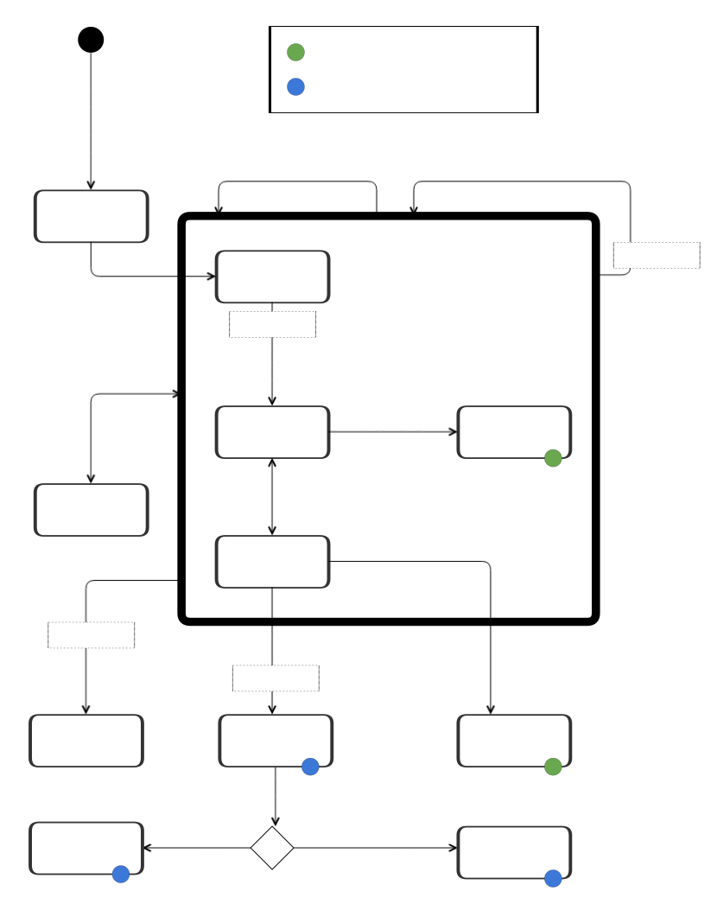

<pre>
jip: 1
title: The Joystream Improvement Proposal Process
authors: [!member](155)
type: Community
category: Meta
description: A social process for improving Joystream.
stage: Draft
created: 2023-02-22
</pre>

# Abstract

A process for how to propose and enact new standards for the Joystream Network and surrounding ecosystem, with an emphasis on transparency, verifiability, formality and clarity, by using the  governance, identity and publishing capabilities of the Joystream blockchain.

# Problem

The subject of this proposal is how to document, propose and update standards in the Joystream Network. By standards one intends to refer very broadly to all protocols, formats, processes or policies involved in coordinating activity among participants in the Joystream project. Like many complex systems, many of these standards have started out initially as unspecified, undocumented or purely embodied as implementations. This has left the community without a body of high quality and coherent documentation, and also no process by which to generate such documentation as standards evolve. Even more importantly, no process exists describing how to revise, extend or create such standards. This limits the pace, safety, quality and adoption of such standards evolution.

# Specification

## Language

The key words “MUST”, “MUST NOT”, “REQUIRED”, “SHALL”, “SHALL NOT”, “SHOULD”, “SHOULD NOT”, “RECOMMENDED”, “NOT RECOMMENDED”, “MAY”, and “OPTIONAL” in this document are to be interpreted as described in RFC 2119 and RFC 8174.

## Concepts

### Proposal, Process and Document

A Joystream Improvement Proposal (JIP) is a well specified and scope constrained initiative, or proposal, for a new standard that in some way improves the Joystream Network. Such proposals are managed through a process described herein, called the _JIP process_, and one of the important activities in this process is the preparation and maintenance of a _JIP document_ which encompasses the substance and status of the proposal.

### Authors

The persons who created the initial proposal. The authors do not change, despite the ownership being transferred at a later time, and the authors become the initial owners unless otherwise stated.

### Owners

The persons working on driving the proposal forward, which may or may not be the same as the authors. They are responsible for responding to questions, incorporating feedback from editors and spreading awareness about the content and merits of a proposal.

### Editors

The persons tasked with supporting authors and owners in understanding and navigating the process successfully while protecting the integrity of the process. They play no role in judging or deciding on the merits of a proposal beyond the specific requirements of the process constraints. The support should come in the support of offering advise, introductions and information relevant to making the proposal properly reviewed and enhanced through feedback. A given JIP proposal does not have a specific formally recognized editor assigned, instead any editor can step in and act in this capacity for any proposal at any time. There should at all times be an identified set of Joystream members, selected by the council, who serve the role of _editors_ in the JIP process. These editors must maintain up to date and accurate contact information in their membership profile on-chain. In cases where editors disagree about specific procedural questions, for example about a proposal, the council must be called to adjudicate through a signal proposal.

### Identification

Persons participating, specifically editors, authors and owners, in the JIP process are identified by their Joystream membership, so specifically their member identifier. Off-chain contact information should be attached to this membership, to the extent that persons are willing to accept inbound requests off-chain. No other identifying or contact information should be included in JIP documents.

### Multiple Roles

It is not precluded that same person can simultaneously occupy multiple roles relevant to a single proposal, with the following specific cases where proposal owner is the same person as

- a council member, in which case the council member must abstain from any corresponding enactment proposal.
- a domain authority for a domain associated with a proposal, in which case an alternative authority should be used _if available_, otherwise proceed as usual.

### Discussion Thread and Proposal Discussions

Proposals are discussed on-chain through the forum system, in a dedicated thread per proposal. This is the primary venue for asking the owners or authors questions, for example from the domain authority, and there should be minimal linking to unauthenticated discussions or resources outside of this thread. There is at all times a dedicated category where such threads should be created for new proposals, and the council ensures such a selected category exists at all times. The scope of discussion in the thread are the merits of the new standard, purely in terms of the substantive technical, economic and social considerations at play, while in contrast, the scope of the proposal discussions threads in the proposal system itself, which exclusively should be concerned with the JIP process itself is being followed properly by the accepting on-chain proposal as part of the JIP process for the JIP proposal.

### Proposal Types

There are two categories of JIP proposal types, called community and council JIPs. The distinction between the two is as follows. Community JIPs are a knowledge and legitimacy producing social processes which do not depend on approval or input from the council on the merits of the standard itself - only the process, and the final outcome of a successful proposal confers no direct guarantee or commitment that the standard will actually be adopted by anyone. **This type of JIP further falls into one among five distinct categories, exclusively for the purpose of thematic organization, the process is the same for all cases. Council JIPs conversely are specifically propositions about making some change where adoption is the intended outcome, and this outcome is under the control of the council, either directly through a self-enforcing on-chain proposal, or indirectly through the governance hierarchy directing the actions of relevant DAO participants.

- **Community:** Proposals who's focus is to generated feedback, discussion and information, which further exists in one among the following non-overlapping categories.
  - **Hard-fork:** Change to the consensus rules in a live blockchain which cannot be enacted through a runtime upgrade.
  - **Recovery:** Social recovery of the blockchain which is no longer live.
  - **Meta:** Altering how the JIP process itself works.
  - **Informational:** A public service announcement on some issue or concern of broad relevance, but not specifically to change any part of the network or it's policies.
  - **Standard:** Any proposed change to the network which does not fall into one of the prior categories. Some example are changes to the runtime, peer-to-peer layer among validators, API or behavior of content delivery and storage nodes or a new metadata for encoding information on the blockchain, which is not validated by validators.
- **Council:** This is reserved for some outcome where council can by some means directly exercise whether the standard outline in a JIP is actually adopted or not, either because it directly depends a proposal, or because adoption by key actors under the direction of the council, e.g. infrastructure operators. Examples here would be runtime upgrades or changing the upper bound of the number of validators.

### Domain and Domain Authorities

In council proposals, where the objective is to enact some new standard, it must be established that certain domain specific expertise has been involved in the review, rendering some final non-binding opinion on the merits of the enactment. Since there are a broad range of topics upon which proposals can depend, being able to make timely and predictable identification of what specific persons qualify as having relevant expertise is of great benefit. _Domains_ are precisely such categorization, and _domain authorities_ are such pre-curated persons for each domain. Here is one example categorization:

- **Runtime & Node:** The messaging or interaction protocol of validators and full nodes.
- **Metadata:** Any structured message standard put on-chain which is not validated by consensus, may be relevant to virtually any other part of the system, but very often the content, governance and membership modules of the chain rely heavily on this.
- **Storage:** The messaging or interaction protocol of storage nodes.
- **Content Delivery:** The messaging or interaction protocol of content delivery nodes.
- **Applications:** How applications display, store or load information across each other and in relation to the end user in a way which is important across a broad range of application categories built on top of the network. One example could for example be a standard format for how to represent a vote, and associated secret information, for the purpose of a later reveal.
- **Governance:** The policies, processes and conventions involved in both the formal governance activities, namely elections and proposals and the JIP process.
- **Moderation:** While in principle understandable as part of governance category, it is likely to be sufficiently important, nuanced and complex, that it requires a distinct category.
- **Gateways:** The operational, technical and economic side of running an application that is economically integrated with the Joystream network, namely that is uses either the infrastructure or content published in the system.

The actual set of domains that exist at any given time, as well as authorities within each domain, is maintained by the council. Notice that these categories are not mutually exclusive, hence they are really more labels than a partitioning of the proposal space. The same person may act as an authority in multiple domains simultaneously.

### Maintenance Edit

A maintenance edit refers to one among a very narrow set of revisions which can be applied to a JIP document even after it has entered states `Final` and `Enacted`, i.e. states where the standard should no longer be revised. These edits allowed for maintenance currently are limited to

1. Correcting purely factual errors.
2. Correcting process mistakes, so any mistake w.r.t. how the JIP process at the time indicated the document should have been managed.
3. Updating structure or content to reflect some new version of the JIP process document standard itself.

### Repository

The public workspace for JIPs is the canonical Git forge, identified by the most recent JIP parameter signal to that effect. The JIP editors will have write access to this repository, and they are also identified by the most recent JIP parameter signal to that effect. The repository must follow these rules

1. History of any branch should never be altered.
2. All changes are through pull-requests, no force-pushing.
3. No editor merges their own pull-requests, another editor must merge.
4. No commit must ever update more than at most on JIP document.
5. No branch making changes to a JIP document compared to `master` can exist.
6. The structure of the repository must include the following:
   - `README.md`: A Markdown document which describes the purpose of the repository.
   - `jip-template.md`: A template Markdown document to be used when creating new JIPs.
   - `/jip-[JIP number]/`: A dedicated folder for each created JIP, where `JIP-number` is the number of the JIP. Within this folder the only constraint is that the primary Markdown document must have name `jip.md`.

### Changelog

All updates to any part of the document after it enters `Review` stage must be logged in this section of the JIP document, perpetually. This information must be organized into a table with columns

1. date: ISO 8601
2. author: member id member
3. rol: so `owner` or `editor`
4. description: one liner
5. link: link to forum post about change
6. maintenance: `yes` or `no`, so whether this change was a maintenance edit.

The table is populated with one row per commit that changes any part of the corresponding JIP document on the `master` branch. 

### On-chain Proposals

The council is involved passing three types of on-chain proposals as part of the JIP process

1. **JIP Process Parameter Update:** A proposal where the council updates _all_ public parameter values that are critical for the process.
2. **JIP Enactment:** A proposal that enacts a council JIP proposal, for example a runtime upgrade, or changing the upper bound on the size of the validator set.
3. **JIP Proposal Stage Transitions:** A signal proposal for a subset of stage transitions in the life-cycle of a proposal, such as when it first enters `Review`.

### Document

A JIP document refers to the combination of a text document and other optional auxiliary files in an accompanying folder. This document plays the role of embodying the public state of a corresponding JIP proposal, and it is also the primary reference for anyone to learn about the proposed standard in the future. The canonical version of the document, for a given proposal, lives appropriately named in the JIP repo.

#### General Constraints

The document must satisfy the following constraints.

1. Must be written in passive voice.
2. Must be written in Standard English.
3. Must be encoded in accordance with Markdown 1.0.1. standard.
4. Linking, by any means, to resources in the repository should be done using relative paths.
5. Linking, by any means, to resources outside the JIP document and repository are not allowed except the following list of exceptions.
   - Git forge (e.g. Github) HTTP URL with git commit hash.
   - IPFS gateway HTTP URL with content identifier.
   - [Joystream On-Chain Links](#joystream-on-chain-links).
6. References to other JIPs should follow the format JIP-N where N is the JIP number you are referring to. Each EIP that is referenced in an JIP MUST be accompanied by a relative markdown link the first time it is referenced, and MAY be accompanied by a link on subsequent references. 
7. Auxiliary files for the N'th JIP should live in the dedicated folder for that JIP, and the maximum total size of all assets in such a folder is 100 MB.
8. Must not include the word "standard", or any variation thereof, or the JIP's number, in the title or description fields of the preamble.
9. Follow the structure described in the [Structure](#structure).

##### Joystream On-Chain Links

Linking to on-chain resources uses a special format makes it easy to describe the resource in a neutral way, and then the source document with such descriptions into a form with full HTTP links to specific . The benefit of such a intermediary linking formats is that if the host on the other end goes down, or changes in some way where old resource routine does not work, then the JIP source documents do not need to all be modified, simply an automated regeneration step solves the problem. The resources to which one may link, and how, are as follows.

1. Proposal with id of `x`: `[!proposal](x)`
2. Proposal discussion post `y` on proposal with id `x`, revision `z`: `[!proposal_discussion](x,y,z)`
3. Forum category with id of `x`: `[!forum_category](x)`
4. Forum thread with id of `x`: `[!forum_thread](x)`
5. Forum post `y` on forum thread with id `x`, revision `z`: `[!forum_post](x,y,z)`, version
6. Member with id of `x`: `[!member](x)`

#### Structure

Here the structure of the document is described. 

- **Preamble:** A RFC 822 style header preamble, preceded and followed by three hyphens (`---`). The headers must appear in the stated order. Headers requiring dates will always do so in the format of ISO 8601 (yyyy-mm-dd). Headers that permit lists must separate elements with commas. Editors should only ever directly make changes to this part of the document.
    - `jip`: JIP number, which must be unique across all JIPs to ever pass `Idea` stage.
    - `title`: A few short words describing the proposal.
    - `authors`: A list of authors of the proposal.
    - `owners` (optional): Persons currently owning proposal, if the set of authors is identical as owners, this header can be omitted.
    - `type`: One of `Community` or `Council`.
    - `category` (optional): One of `Hard-fork`, `Recovery`, `Meta`, `Informational` or `Standard`. Must be present if and only if type is `Community`.
    - `domains` (optional): A list of distinct domains, all taken from the list of domains signalled by the council through the most recent proposal parameter update. Must be present if and only if type is `Council`. 
    - `description`: One full short sentence describing the new standard.
    - `forum-thread`: Link to on-chain forum thread for discussing proposal.
    - `stage`: One of `Draft`, `Review`, `Living`, `Stagnant`, `Last Call`, `Withdrawn`, `Enactable`, `Final`, `Rejected`, `Enacted`.
    - `last-call-deadline` (optional): The date last call period ends on when in stage `Last Call`.
    - `created`: Date the JIP entered `Draft` stage.
    - `requires` (optional): A list of JIP numbers for other JIPs this proposal requires, in the sense that this proposal cannot be understood or implemented without a concept or technical element from another a prior proposal. Merely mentioning another proposal does not necessarily create such a dependency.
    - `proposals`: A list of links to on-chain proposal every proposal executed, ordered by execution time, which is explicitly about this proposal, or is a parameter update proposal which indirectly impacts this proposal.
- **Abstract:** A multi-sentence (short paragraph) technical summary.
- **Problem:** A clear explanation of what is currently wrong, in terms of broadly accepted harms, risks or unreaped rewards. Care must be made to not focus on absence of a particular solution as the problem, but instead on the problem itself, in a way which in this section plausibly could be addressed by a range of different alternatives not yet specified.
- **Proposal (optional):** Exact statement of what on-chain proposal is to be enacted, fully specified at all times for all council proposals. It must include a complete rationale text, an exact on-chain proposal type, and fully specified parameter values.
- **Specification:** A neutral, precise and clear description of a particular solution. It should be clear and detailed enough to allow independent third parties to implement or instantiate purely based on this text and associated materials.
- **Rationale:** The rationale fleshes out the specification by describing what motivated the design and why particular design decisions were made. It should describe alternate designs that were considered and related work.
- **Backwards Compatibility (optional):** If this standard introduce some backwards incompatibility, in the sense that third parties will have to change their software in order to retain interoperability for their existing purposes, then this must be clearly identified and described.
- **Test Cases (optional):** Test cases for any third party whishing to make an implementation of the change. Should either be inlined in the JIP as data (such as input/expected output pairs, or as auxillary asset). 
- **Reference Implementation (optional):** Reference/example implementation that people can use to assist in understanding or implementing this specification. 
- **Security Considerations (optional):** Discussion of the security implications/considerations relevant to the proposed change. Include information that might be important for security discussions, surfaces risks and can be used throughout the life-cycle of the proposal. E.g. include security-relevant design decisions, concerns, important discussions, implementation-specific guidance and pitfalls, an outline of threats and risks and how they are being addressed.
- **Copyright:** Copyright Waiver - All JIPs must be in the public domain. The copyright waiver MUST link to the license file and use the following wording: `Copyright and related rights waived via [CC0](/LICENSE).`
- **Citation:** Describes citation format for this document.
- **Changelog:** A log of changes to the document, read more [here](#changelog)

## Process

The following describes the JIP process in terms of the life-cycle of an individual JIP proposal. For each stage of the process, a high level semantic meaning is described, along with explicit set of changes which can occur, and under what conditions. Most of what is described applies to both community and council proposal types, as their processes have very similar state transitions, however transitions and states unique to only one are also clearly identified. The following state machine diagram is a useful reference for succinctly summarizing the main points. Note that an arrow represents an event which can take place in the stage or group of stages from which it emanates.

### `Idea`

The purpose of this stage is allow the authors to obtain initial informal feedback on the problem they are tackling, before investing any substantial effort, so as to conduct a quick sanity check on feasibility, alternatives and prospects for support. Ideally this would be before having spent much time writing anything concrete, like the JIP document or any implementation. Appropriate points of feedback would for example be 

- editors
- domain authorities
- council
- other JIP authors
- infrastructure operators
- app operators

It may be fine to open up an early forum thread for idea stage discussion, but be aware that this will not be the ultimate discussion venue if the proposal progresses. If the authors determine that they will initiate a proposal, then they have to prepare a first complete draft of their JIP document and open a pull request, and alert the editors. Anyone can open the request, author authentication is not needed on Github, this happens later. The document must 

- be in `draft` stage when the request is opened.
- have type properly set: council vs community. This value cannot be changed later, and so a new JIP must be created if this turns out to be wrong.

### `Draft`

The purpose of this stage is to prepare the proposal for public review by making sure it complies with the JIP document requirements. Once an editor is satisfied with the JIP document and pull request, they must open a signal proposal to this effect, and the rationale of this proposal must refer to

1. That the purpose is to advance a proposal to `draft` stage.
2. The full text version of the JIP document, with a commit hash.
3. The proposed JIP number, which must be unique across all JIPs to ever pass `Idea` stage.
4. Appropriate domains have been set for a council proposal.

**The author must not do this, and such a proposal must be rejected by the council**. If the proposal fails, it can be a new one can be reopened again at any time. All authors listed in the document must submit a confirmatory message in the proposal discussion thread using their proposal memberships, attesting to the authenticity of their claimed involvement as authors. Only after this has occurred should any council member approve such a proposal. If during deliberation, changes are made prior to proposal passing, then this should be added to the discussion log of the proposal by the editor only. Once the proposal is approved, the pull request can be merged with the updated JIP number and a reference to the now created discussion thread in the appropriate forum category.

### `Review`

The purpose of this stage is to allow open-ended discussion and deliberation around the merits of a proposal, possibly including further revisions to the content of the JIP document by the owners, in order to either clarify, revise or extend the proposal. When the editor determines that the process has been followed, in particular w.r.t. owners responding to all open questions and domains reflecting possibly updated scope of a council proposal, and that they are not intending to make additional changes to the proposal based on current or anticipated future feedback, the proposal should progress. If it is intended to be a `Living` proposal, i.e. it is expected that it will need to be updated in the future, this should be agreed between editors and owners, if not, it should go to the `Last Call` stage, both occur without any on-chain proposal. The field `last-call-deadline` must be set to some future date by which a transition to the next stage is expected. This should be 14 days into the future.

### `Last Call`

The purpose of this stage is to escalate the imperative for all relevant stakeholders voice their input, as a scheduled transition to the next state will be expected at some specific time in the future.

If the Editor determines that it is appropriate, or the owner make the request, the editor may update the stage back to `Review`, for example if new critical changes are found to be needed in the proposal, and that feedback on these changes cannot be conducted within the remaining time.

For community proposals, once the last call deadline has expired and the editor is otherwise satisfied with the process, the stage can be set to `Final`.

For council proposals, at least one authority for each domain listed in the proposal must provide their final opinion on whether the proposal should be enacted.

For council proposals, domain authorities for each domain in the proposal provide their opinion on the merits of enacting the proposal as contemplated. The editor is tasked with coordinating and encouraging them to do this in a timely manner. Opinions can be provided also during `Review` stage, if it is truly unavoidable, but the first best is `Last Call`. This opinion is provided in the discussion thread, and it must explicitly reference the now stable version of the document in terms of an exact commit. Unless major changes are made to the proposal, an authority cannot provide a new opinion on a given domain. More than one authority can provide their opinion on one domain, and all such statements must clearly specify

- domains
- conclusion (yes/no)
- rationale

Once the last call deadline has expired and at last one domain authority has signed off for each domain listed in the proposal, then the editor must advance the proposal to stage `Enactable`. At this point the editor must open the enactment proposal for putting the JIP proposal into effect. The specific on-chain proposal type, parameters and rationale text, is already specified in the proposal. The editor must also in the rationale reference the forum posts of opinion statements submitted by domain authorities for domains in the proposal.

### `Enactable` 

The purpose of this stage is to wait for the resolution of the enactment proposal by the current council. If the on-chain proposal is not executed, for any reason, then the JIP proposal must have it's stage set to `Rejected`, otherwise it should have it's stage set to `Enacted`.

### `Enacted`

The purpose of this stage is to represent that the council proposal was enacted, and the only subsequent change that should be made are.

### `Stagnant`

The purpose of this stage is to represent that the editor was not satisfied to move the proposal forward, and no adequate progress was made for at least two months by any the current owners as to even count as it being active. This can happen from any of the stages `Draft`, `Review`, `Last Call` and `Living`. A proposal an recover from this stage, back to the most recent one, when the editor has reason to expect that progress will be made, either by current or alternative future owners. However during this stage, no other changes can be made to the proposal or document.

### `Withdrawn`

The purpose of this stage is to represent that the last owners no longer intended for the proposal to either be `Living` or progress further to some final stage where third parties could interpret it as being active. For this stage only maintenance edits are allowed.

### `Final`

The purpose of this stage is to represent that the community proposal has gone through the entire review and discussion pipeline, hopefully enjoying useful feedback that both raised quality of proposal and generated knowledge in the community. Both the authors and the last owners were satisfied with it's final form and evolution, and the only subsequent change that should be made is maintenance edits.

### `Living`

The purpose of this stage is to represent the same as the `Final` stage for community proposals, except that in this case, it is expected that the material changes may be needed to the substance of the proposal itself.

### General Events

There are a number of general events during the JIP proposal process which are feasible  across a number of stages, hence they are grouped here distinct from any specific stage.

#### Ownership Update

During `Draft`, `Review`, `Last Call` and `Living` stages, the ownership set can be updated. This can be for any reason, it is always allowed as long as there remains at least one owner after the change. The update requires the editor to create an on-chain signal proposal to this effect, and the rationale must include

- JIP number of proposal.
- what current owners are being removed, if any.
- what new owners are being introduced, if any.
- some explanation as to the cause and timing of the change.
- a link to an open pull request where the owner field of the JIP document is updated.

After the proposal has been created, all impacted owners must submit a statement in the proposal discussion thread which confirms that they intend to either no longer be, or now become, an owner. The council must not pass the proposal if 

- there is no net change in owners, or
- at least one owner listed for removal has not confirmed this, or
- at least one owner listed as being introduced as not confirmed this.

Once the on-chain proposal has been executed, the editor can merge the pull request.

#### Stage Transitions and Revisions Merged

For all stage transitions, this must be updated in JIP document by the editor, and the editor only. The editor can merge revisions only to the header, but at any stage, as long a they are appropriate for the stage. Whenever revisions are merged which alter a JIP document, for this or any other reason, then the discussion thread must be notified by the editor, and the editor only, about the nature of the merge, which must include

- a one line description of the purpose of the revision
- who has authored the revisions
- new commit hash for repository
- git log of new commits introduced which alter the JIP document

Any such revisions must also be reflected in the changelog.
This is obviously only feasible only after the transition to `Review` from `Draft`, when the discussion thread is created. While the authors provide the initial draft, revisions including their contributions can only occur in stages `Draft`, `Review`, `Last Call` and `Living` after this, and these can only affect the body section of the JIP document, or auxillary assets, not the header. The authors should always try to batch together logically coherent sets of changes in order to not generate too much noise in the thread.

#### Stagnation

During `Draft`, `Review`, `Last Call` and `Living` stages, if the editor determines that no adequate progress is being made for at least two months by ant current owners, then the stage can be updated to `Stagnant`.

#### Council JIP Process Parameter Update

The council may at any time broadcast changes to some public parameter values which impact the JIP process for all current and future proposals. This kind of proposal is called JIP signal proposal, and such a proposal may at least one, and possibly multiple, of the following parameters

- List of current JIP editors.
- Link to current JIP repository.
- List of current domains and corresponding authorities.
- Forum category ID for discussion threads.

Importantly, any proposal which has relied on a given value as part of some earlier stage of it's life-cycle can continue to do so, if it is still feasible.

#### Withdrawal

During `Draft`, `Review`, `Last Call` and `Living` stages, the current owners can elect to withdraw their proposal by opening an on-chain signal proposal with a rationale that includes

- JIP number
- the reason for the withdrawal

and each owner must affirm the withdrawal intention in the proposal discussion thread. Once the proposal is executed, the editor can update the proposal document and repo.

### Blockchain Liveness Failure

There may be times where there is a desire to conduct the JIP process, but the chain itself is not live for some reason. The JIP repository itself can be used as the record which substitutes for the on-chain signal proposals, and then later and informational JIP should be published about what took place.

## RFC 2119 and RFC 8174

JIPs are encouraged to follow RFC 2119 and RFC 8174 for terminology and to insert the following at the beginning of the Specification section:

> The key words “MUST”, “MUST NOT”, “REQUIRED”, “SHALL”, “SHALL NOT”, “SHOULD”, “SHOULD NOT”, “RECOMMENDED”, “NOT RECOMMENDED”, “MAY”, and “OPTIONAL” in this document are to be interpreted as described in RFC 2119 and RFC 8174.

# Rationale

Joystream Improvement Proposal (JIP) process, or JIP process for short, is heavily inspired by the Bitcoin Improvement Proposal ([BIP](https://github.com/bitcoin/bips)) and Ethereum Improvement Proposal ([EIP](https://eips.ethereum.org/)) processes. The JIP process attempts to improve upon these earlier approaches by taking advantage of the inherent governance, [binding upgrades](https://docs.substrate.io/build/upgrade-the-runtime/), accountability and publishing capabilities of the Joystream blockchain and DAO. The aspiration is that this will help generated greater transparency and legitimacy for how changes are made, contributing to the pace of innovation and preservation of network effect by avoiding some of the prior challenges around [highly subjective rules](https://github.com/bitcoin/bips/blob/master/bip-0002.mediawiki#rationale), [arbitrary](https://eips.ethereum.org/EIPS/eip-1#eip-editors) [authorities](https://github.com/bitcoin/bips/blob/master/bip-0001.mediawiki#bip-editors) and [arbitrary venues](https://github.com/ethereum/EIPs/blob/master/EIPS/eip-1.md#core-eips). This document has in multiple places been copied from the guideline documents of those processes. 

# Copyright

This document is in the public domain.

# Citation

Please cite this document as:

Bedeho Mender, "JIP-1: The Joystream Improvement Proposal Process" Joystream Improvement Proposals, no. 1, February 2023.

# Changelog

| Date | Author | Role | Description | Link | Maintenance Edit |
|:-----|:-------|:-----|:------------|:----:|:----------------:|